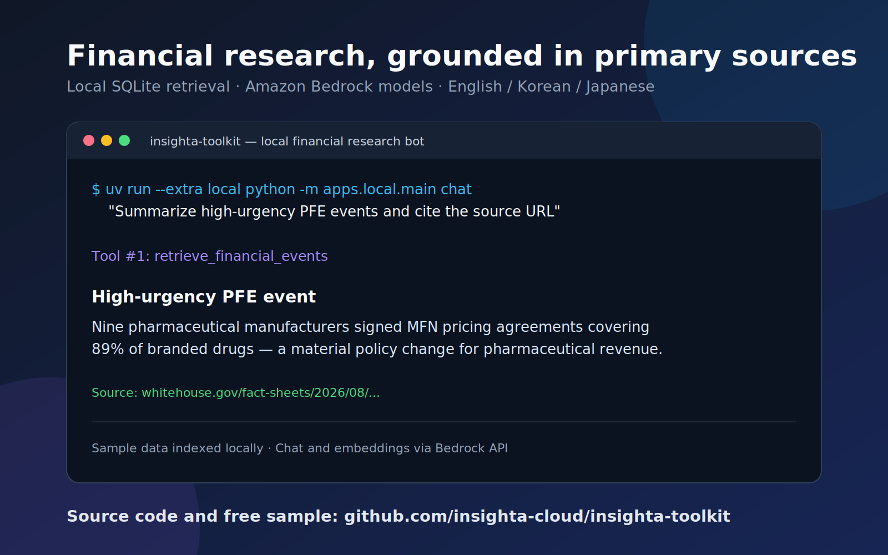
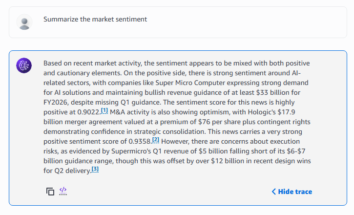

# Insighta Toolkit

[English](README.md) | [한국어](README.ko.md) | [日本語](README.ja.md)

Insighta Toolkit은 금융 이벤트 검색 애플리케이션을 만들기 위한 참조 구현입니다. 다국어
이벤트 JSONL을 검색 가능한 근거로 만들고, 사용자가 원문 출처 URL을 인용하는 답변을 받을 수
있게 합니다.

이 저장소의 중심은 데이터셋이 아니라 **툴킷**입니다. 애플리케이션 구조, 검색 계약, 배포
선택지를 직접 실행하고 자체 데이터와 모델에 맞게 확장할 수 있도록 제공합니다. 포함된 JSONL은
코드를 시험하기 위한 작은 입력 데이터일 뿐입니다.

## 실행할 수 있는 두 경로

| 경로 | 실행 내용 | 적합한 경우 |
| --- | --- | --- |
| **로컬 Strands + Bedrock** | JSONL과 벡터 검색은 로컬 SQLite에, 임베딩과 채팅은 Bedrock에 둡니다. | 한 대의 장비에서 워크플로와 검색 결과를 직접 확인할 때 |
| **AWS AgentCore** | AgentCore Runtime에서 Strands 검색 에이전트를 실행하고 OpenTofu로 S3·S3 Vectors를 구성합니다. | 배포 가능한 AWS 참조 아키텍처가 필요할 때 |

두 경로 모두 모델의 답변을 사실로 간주하지 않고 검색된 레코드에서 답변을 만듭니다. 결과에는
원문 이벤트 URL이 남아 있으므로 사용자가 근거를 열어 확인할 수 있습니다.

## 동작 방식

```text
JSONL 이벤트 레코드
        │
        ├── id·언어·제목·본문·메타데이터 검증
        ├── 언어별 검색 문서 생성
        ├── 제목 + 본문 임베딩
        └── 질문에 관련된 레코드 검색
                                      │
                                      ▼
                         출처 URL을 포함한
                         Strands 에이전트 답변
```

공유 레코드 계약은 논리 이벤트의 `id`, 언어별 `title`·`content`, 티커, 긴급도·감성 필드,
출처 메타데이터를 정의합니다. 로컬과 AWS 경로는 같은 계약을 사용하므로 입력 형식을
다시 설계하지 않고도 경로를 바꿀 수 있습니다.

## 로컬에서 시작하기

로컬 앱은 Toolkit을 가장 빠르게 이해하는 방법입니다. 선택한 Bedrock 모델을 사용할 수 있는
AWS 자격 증명을 설정한 뒤 샘플을 인덱싱하고 질문합니다.

```bash
export AWS_PROFILE=<your-profile>
uv sync --extra local
uv run --extra local python -m apps.local.main index sample/202608_60x3.jsonl
uv run --extra local python -m apps.local.main chat "고긴급 이벤트를 요약하고 출처 URL을 인용해줘."
```

터미널에서는 검색 단계가 그대로 드러납니다. 질문은 금융 이벤트 검색 도구를 호출하고, 짧은
답변과 이를 뒷받침하는 출처 URL을 함께 반환합니다. 데이터, 임베딩 모델, 검색 설정이 유용한
근거를 만드는지 가장 빠르게 확인하는 방법입니다.



인덱스는 Git에서 제외되는 로컬 `.local/insighta.db`에 저장됩니다. 제공자 설정, 데이터베이스
선택, 모델 변경은 [로컬 빠른 시작](docs/local-strands.md)을 참고하세요.

## AWS 참조 경로 배포하기

AWS 경로는 `apps/agentcore`를 패키징하고 OpenTofu로 런타임과 벡터 저장소를 구성한 뒤,
동일한 JSONL 계약을 적재합니다. 이는 인프라와 애플리케이션 참조 구현이며, 조직의 접근 제어,
모니터링, 데이터 거버넌스를 대신하지는 않습니다.

정확한 사전 요구사항, 빌드, 배포, 적재, 호출 순서는
[AWS AgentCore 빠른 시작](docs/getting-started.md)을 따르세요.

사용자용 애플리케이션에서도 같은 근거 기반 상호작용을 유지하세요. 추적할 수 없는 모델 주장
대신, 읽기 쉬운 답변과 확인 가능한 검색 출처 참조를 제공해야 합니다.



## 포함된 샘플

[`sample/202608_60x3.jsonl`](sample/202608_60x3.jsonl)은 Toolkit용으로 작게 구성한 다국어
테스트 입력입니다. 논리 이벤트 60개와 레코드 180개로 구성되며, 이벤트마다 영어(`en`),
한국어(`ko`), 일본어(`ja`) 레코드가 하나씩 있습니다. 다음을 확인하는 데 사용하세요.

- UTF-8 JSONL 파싱
- 하나의 이벤트를 세 언어에서 검색하는 동작
- 티커·긴급도 메타데이터를 이용한 필터링과 정렬
- 답변과 함께 원문 출처 URL을 반환하는 동작

| 필드 | Toolkit에서의 용도 |
| --- | --- |
| `id`, `language` | 하나의 이벤트에 속한 세 언어 레코드를 정렬합니다. |
| `title`, `content` | 임베딩과 검색 계층에 보내는 텍스트입니다. |
| `tickers`, `urgency_level`, `sentiment_score` | 구조화된 필터링과 정렬을 지원합니다. |
| `source`, `source_name`, `author`, `created_at` | 답변 옆에 출처 정보를 표시합니다. |

샘플은 평가용 입력이지 실시간 피드나 투자 자문이 아닙니다. 중요한 용도에서는 생성된 답변을
반드시 링크된 원문 출처와 대조하세요.

## 저장소 구조

```text
apps/local/       로컬 Strands 애플리케이션과 SQLite 벡터 저장소
apps/agentcore/   AgentCore Runtime 진입점
infra/            AWS 참조 경로용 OpenTofu 구성
src-python/       공유 JSONL 적재·검색·문서 helper
sample/           공개 JSONL 테스트 입력
docs/             로컬 및 AWS 빠른 시작
tests/            공유 검색 계약의 단위 테스트
```

## 라이선스

SEE LICENSE IN [LICENSE](LICENSE).

## AWS 리소스 정리

AWS 참조 경로를 배포했다면, 생성에 사용한 동일한 `infra/` state에서 정리해야 합니다.
먼저 `tofu plan -destroy`를 검토하세요. records bucket은 `tofu destroy` 전에 비워야 하며,
버킷을 비우면 객체가 영구적으로 삭제됩니다. 명령을 실행하기 전에
[AWS 리소스 정리 안내](docs/getting-started.md#clean-up)를 확인하세요.

## insighta cloud 소개

우리는 개인을 위한 투자 워크스테이션을 구축하고 있습니다. 개인 투자자에게 기관급 프로세스와
도구를 제공합니다. [insighta.cloud/landing](https://insighta.cloud/landing)에서 자세히 확인하세요.

## 연락처

- **제공자:** insighta cloud Inc.
- **웹사이트:** [https://insighta.cloud](https://insighta.cloud)
- **연락처:** support@insighta.cloud
- **AWS Marketplace:** [판매자 프로필](https://aws.amazon.com/marketplace/seller-profile?id=seller-ahk55ljrhr4wu)
- **Datarade 제공자 프로필:** [insighta cloud Inc.](https://datarade.ai/data-providers/insighta-cloud-inc/profile)
- **LinkedIn:** [cho-insighta-cloud](https://www.linkedin.com/in/cho-insighta-cloud/)

## 저자

insighta cloud Inc.
